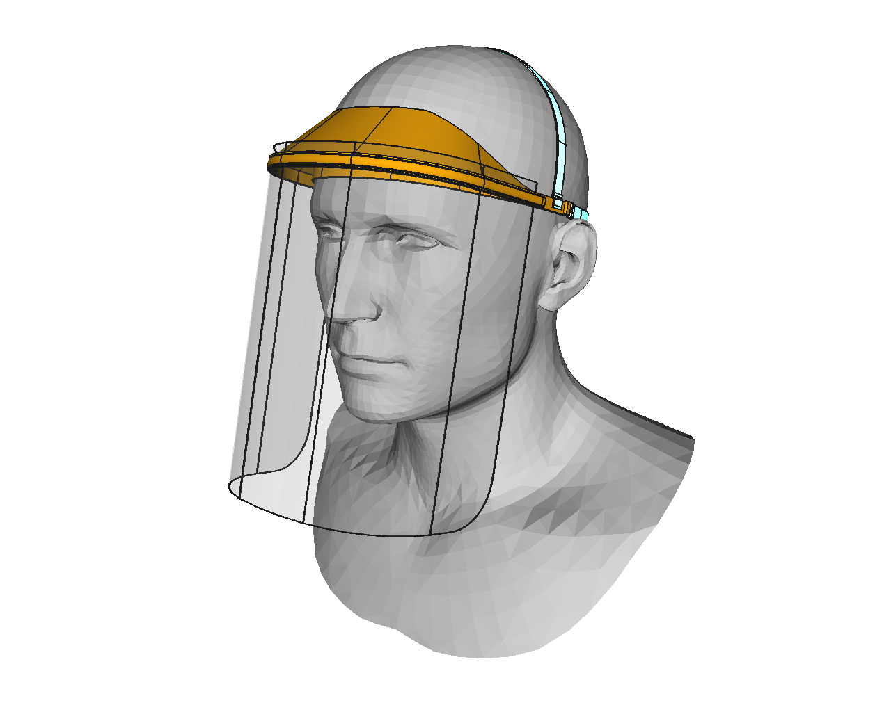

# CV19-Shield
A variant of the [coronavirusmakersgalicia.org](https://coronavirusmakersgalicia.org) protection shield to incorporate some optimizations.

This model was built with [FreeCAD 0.19](https://freecadweb.org), a free and open-source 3D-CAD editor/modeller, using the available STL as reference (loosely).

## Optimizations

1. **Ergonomics:** used a realistic human head model to fit better the contours and lines.
2. **Stand-alone:** included fasten mechanism for the PVC sheet that requires no extra tools or pieces.
3. **3D printing:** the model was redesigned to reduce 3D-printing hassles (ex. variable width walls).
4. **Slicing:** all measures in the model were adjusted to be multiple of a nozzle width of 0.4, avoiding half-lines or artifacts so it can be printed faster.

## Files

* Original FreeCAD file
* Step file (exported from FreeCAD)
* STL file (exported from FreeCAD in HQ)
* Creality CR-10S gcode for 1 and 4 items (draft quality: 0.25 height, 90 mm/s, ~ 1h15'/item ).

## LICENCIA / LICENSE

This work is licensed under the [GNU General Public License v3.0](LICENSE-GPLV30). All media and data files that are not source code are licensed under the [Creative Commons Attribution 4.0 BY-SA license](LICENSE-CCBYSA40).

More information about licenses in [Opensource licenses](https://opensource.org/licenses/) and [Creative Commons licenses](https://creativecommons.org/licenses/).

Este trabajo esta sujeto a la licencia [GNU General Public v3.0 License](LICENSE-GPLV30). Todos los ficheros multimedia y de datos que no sean código fuente están sujetos a la licencia [Creative Commons Attribution 4.0 BY-SA license](LICENSE-CCBYSA40).

Más información acerca de estas licencias en [licencias Opensource](https://opensource.org/licenses/) y [licencias Creative Commons](https://creativecommons.org/licenses/).
